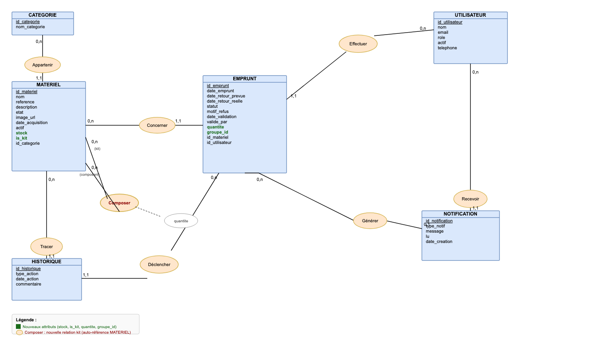
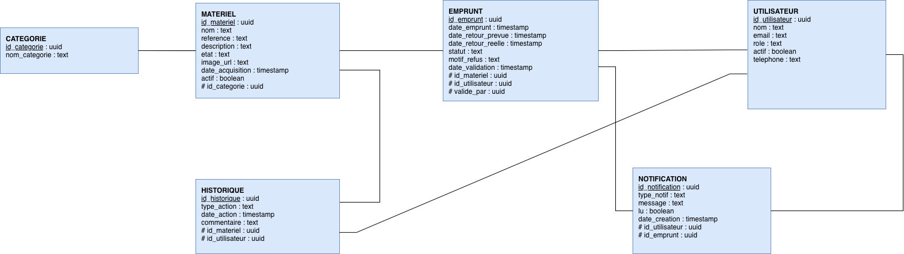

# Base de données — IcamTrack

Documentation de la conception de la base de données : modèle conceptuel (MCD) et modèle logique (MLD).

## MCD — Modèle Conceptuel de Données

## MLD — Modèle Logique de Données

Notation : la clé primaire est soulignée, les clés étrangères sont précédées de `#`.

### Détail des tables

#### CATEGORIE
| Colonne | Type | Clé |
|---|---|---|
| id_categorie | uuid | PK |
| nom_categorie | text | |

#### UTILISATEUR
| Colonne | Type | Clé |
|---|---|---|
| id_utilisateur | uuid | PK |
| nom | text | |
| email | text | |
| role | text | |

#### MATERIEL
| Colonne | Type | Clé |
|---|---|---|
| id_materiel | uuid | PK |
| nom | text | |
| reference | text | |
| description | text | |
| etat | text | |
| id_categorie | uuid | FK |

#### EMPRUNT
| Colonne | Type | Clé |
|---|---|---|
| id_emprunt | uuid | PK |
| date_emprunt | timestamp | |
| date_retour_prevue | timestamp | |
| date_retour_reelle | timestamp | |
| statut | text | |
| id_materiel | uuid | FK |
| id_utilisateur | uuid | FK |

#### HISTORIQUE
| Colonne | Type | Clé |
|---|---|---|
| id_historique | uuid | PK |
| type_action | text | |
| date_action | timestamp | |
| commentaire | text | |
| id_materiel | uuid | FK |
| id_utilisateur | uuid | FK |

## Notes de conception

- L'identifiant de chaque table (`id_…`) est généré automatiquement par la base ; il n'est jamais saisi à la main.
- Le champ `etat` de MATERIEL prend les valeurs `disponible`, `emprunte` ou `indisponible` (par ex. pour un matériel en réparation).
- La table EMPRUNT n'est jamais vidée : elle constitue l'historique des prêts.
- La table HISTORIQUE journalise tous les mouvements du parc (création, emprunt, retour, mise en réparation…). Ces lignes sont écrites automatiquement par l'application ou par un trigger.
- Aucune table d'association supplémentaire n'est nécessaire : toutes les relations sont de type « un à plusieurs ».
