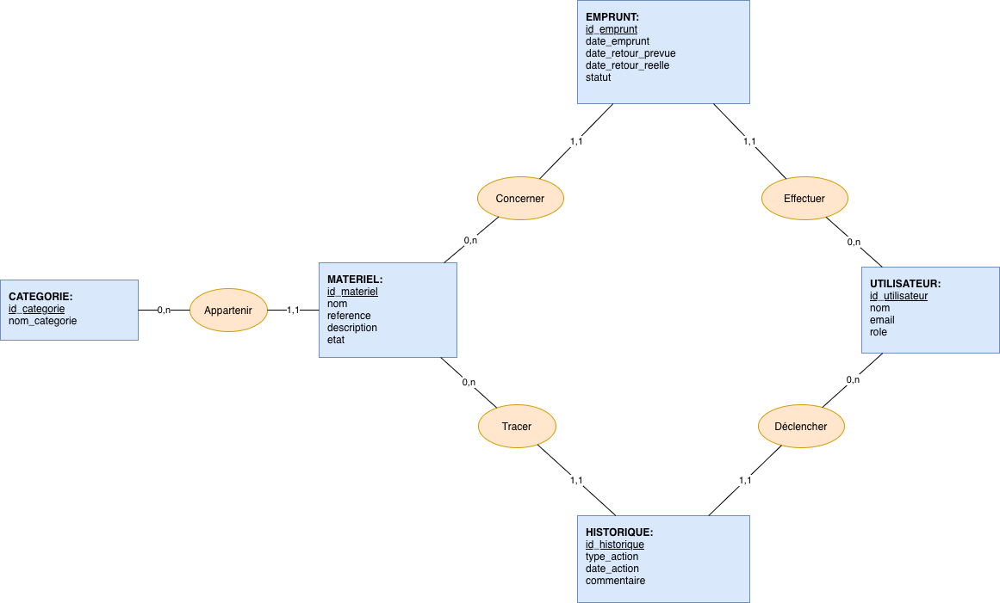

# Base de données — IcamTrack

Documentation de la conception de la base de données : modèle conceptuel (MCD) et modèle logique (MLD).

## MCD — Modèle Conceptuel de Données

### Les 5 entités

**CATEGORIE**
- _id_categorie_ (identifiant)
- nom_categorie

**MATERIEL**
- _id_materiel_ (identifiant)
- nom
- reference
- description
- etat

**UTILISATEUR**
- _id_utilisateur_ (identifiant)
- nom
- email
- role

**EMPRUNT**
- _id_emprunt_ (identifiant)
- date_emprunt
- date_retour_prevue
- date_retour_reelle
- statut

**HISTORIQUE**
- _id_historique_ (identifiant)
- type_action
- date_action
- commentaire

## MLD — Modèle Logique de Données

> Glisse ici l'image exportée depuis draw.io.

Notation : la clé primaire est soulignée, les clés étrangères sont précédées de `#`.

**CATEGORIE** ( _id_categorie_, nom_categorie )

**UTILISATEUR** ( _id_utilisateur_, nom, email, role )

**MATERIEL** ( _id_materiel_, nom, reference, description, etat, #id_categorie )

**EMPRUNT** ( _id_emprunt_, date_emprunt, date_retour_prevue, date_retour_reelle, statut, #id_materiel, #id_utilisateur )

**HISTORIQUE** ( _id_historique_, type_action, date_action, commentaire, #id_materiel, #id_utilisateur )

### Détail des tables

#### CATEGORIE
| Colonne | Type | Clé |
|---|---|---|
| id_categorie | uuid | PK |
| nom_categorie | text | |

#### UTILISATEUR
| Colonne | Type | Clé |
|---|---|---|
| id_utilisateur | uuid | PK |
| nom | text | |
| email | text | |
| role | text | |

#### MATERIEL
| Colonne | Type | Clé |
|---|---|---|
| id_materiel | uuid | PK |
| nom | text | |
| reference | text | |
| description | text | |
| etat | text | |
| id_categorie | uuid | FK |

#### EMPRUNT
| Colonne | Type | Clé |
|---|---|---|
| id_emprunt | uuid | PK |
| date_emprunt | timestamp | |
| date_retour_prevue | timestamp | |
| date_retour_reelle | timestamp | |
| statut | text | |
| id_materiel | uuid | FK |
| id_utilisateur | uuid | FK |

#### HISTORIQUE
| Colonne | Type | Clé |
|---|---|---|
| id_historique | uuid | PK |
| type_action | text | |
| date_action | timestamp | |
| commentaire | text | |
| id_materiel | uuid | FK |
| id_utilisateur | uuid | FK |

### Liens entre les tables
- `CATEGORIE.id_categorie` (1) → (∞) `MATERIEL.id_categorie`
- `MATERIEL.id_materiel` (1) → (∞) `EMPRUNT.id_materiel`
- `UTILISATEUR.id_utilisateur` (1) → (∞) `EMPRUNT.id_utilisateur`
- `MATERIEL.id_materiel` (1) → (∞) `HISTORIQUE.id_materiel`
- `UTILISATEUR.id_utilisateur` (1) → (∞) `HISTORIQUE.id_utilisateur`

---

## Notes de conception

- L'identifiant de chaque table (`id_…`) est généré automatiquement par la base ; il n'est jamais saisi à la main.
- Le champ `etat` de MATERIEL prend les valeurs `disponible`, `emprunte` ou `indisponible` (par ex. pour un matériel en réparation).
- La table EMPRUNT n'est jamais vidée : elle constitue l'historique des prêts.
- La table HISTORIQUE journalise tous les mouvements du parc (création, emprunt, retour, mise en réparation…). Ces lignes sont écrites automatiquement par l'application ou par un trigger.
- Aucune table d'association supplémentaire n'est nécessaire : toutes les relations sont de type « un à plusieurs ».
